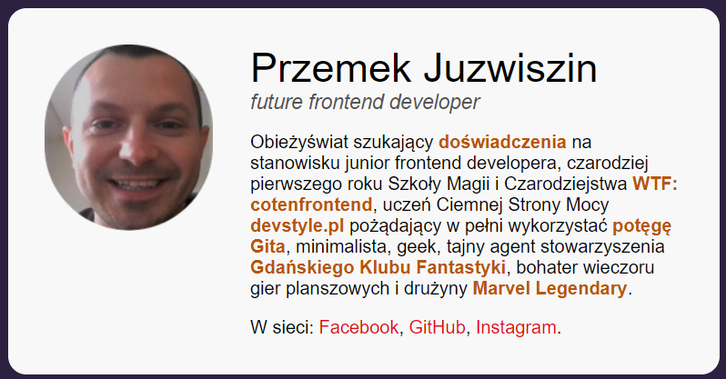

# Business card

My business card 📇

Please visit my: [business card](https://przemekjuzwiszin.github.io/my_business_card/)

## Tools & technologies I've used: 🧰

- Figma
- Visual Studio Code
- Git
- Trello (KANBAN method)
- Windows console
- BEM
- Live server
- CSS: flex

### I relied on three languages: 🌎

- HTML
- CSS
- Markdown

#### What I learned: ✂

- Writing semantic HTML
- Using @media queries
- Using BEM for styling
- Cutting the design
- Writing a nice looking readme.md file
